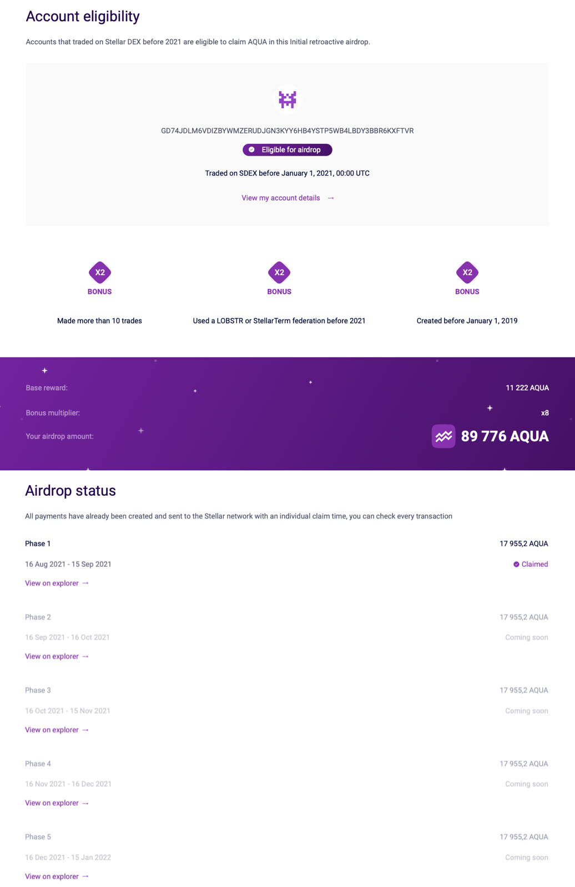

# Airdrop Checker Frontend

Knowing if your wallet is eligible or not might be a bit confusing, especially if you haven’t used a wallet for some time or it was previously merged to reduce the number of wallets you held.  
This tool will help you see which wallets are eligible for the airdrop.

#### More information:

[The Eligibility Checker Guide](https://medium.com/aquarius-aqua/initial-airdrop-the-eligibility-checker-c4f8c820ecf9)  
[Aqua Website](https://aqua.network/)

### Prepare

Run `npm install` to install all dependencies

### Development server

Run `npm run start` for a dev server. Page will opens automatically in browser

### Build

Run `npm run build` to build the project. The build artifacts will be stored in the `dist/` directory.
